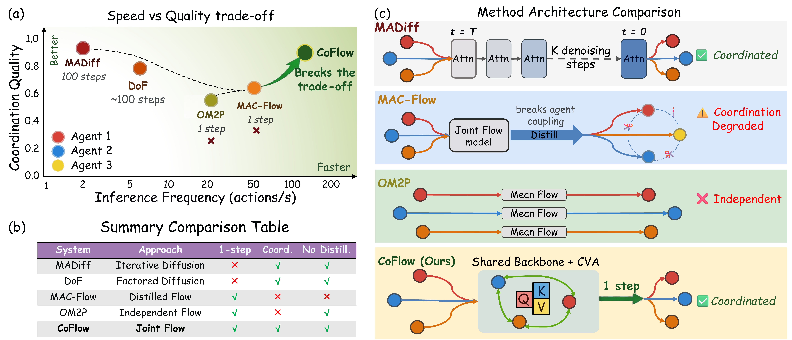
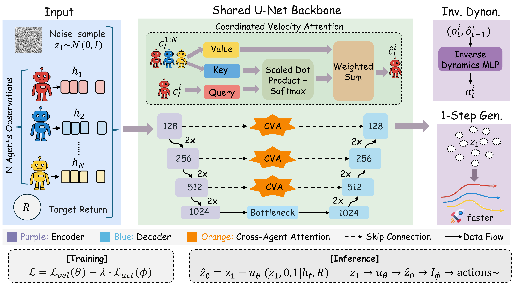
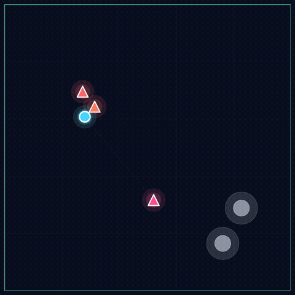
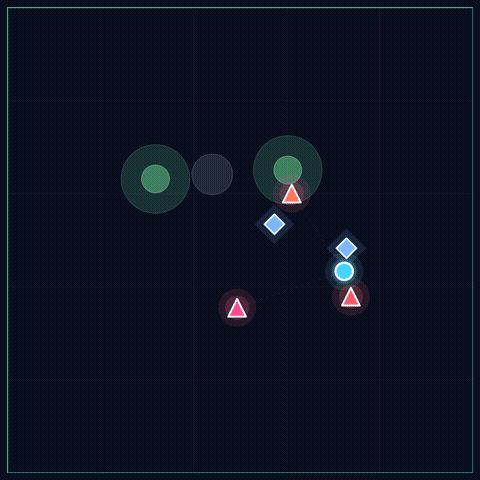
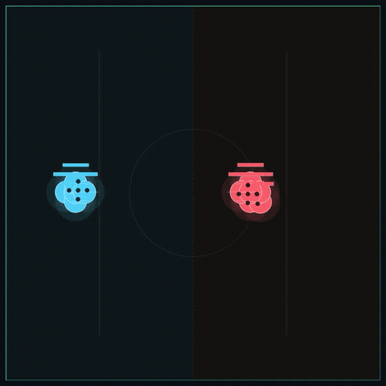
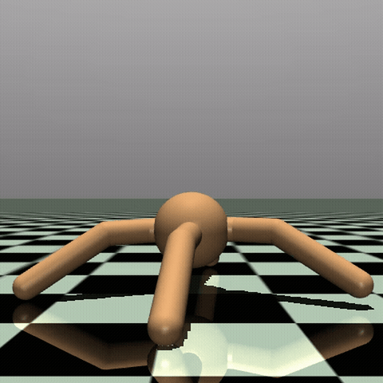
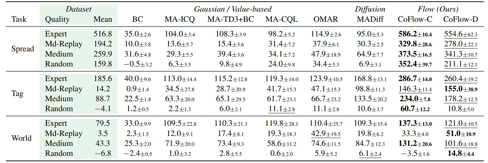
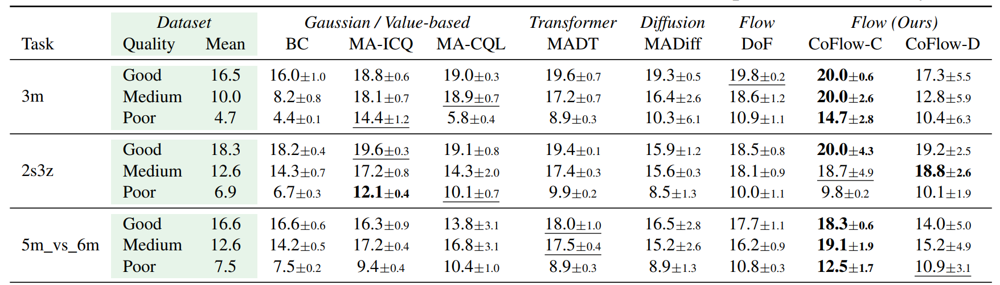
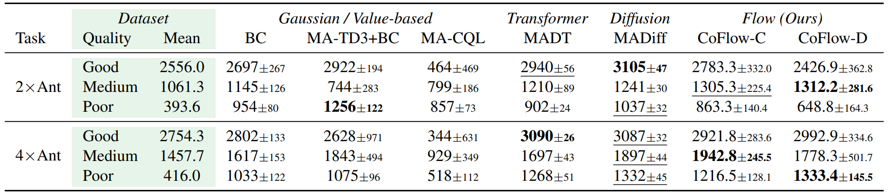

# coflow

This repository contains the official source-code release for
`coflow: Coordinated Few-Step Flow for Offline Multi-Agent Decision Making`.

## Authors

[Guowei Zou](https://guowei-zou.github.io/Guowei-Zou/), Haitao Wang,
[Beiwen Zhang](https://github.com/BeiwenZhang), Boning Zhang, and
[Hejun Wu](https://cse.sysu.edu.cn/teacher/WuHejun)

Sun Yat-sen University

## Links

[](https://guowei-zou.github.io/coflow/)
[](https://arxiv.org/abs/2605.01457)
[](https://huggingface.co/Guowei-Zou/CoFlow-checkpoints)
[](#datasets)

## Motivation



CoFlow targets the quality-efficiency dilemma in offline multi-agent trajectory
generation. Existing diffusion methods preserve coordination but require many
denoising steps; existing few-step routes accelerate inference but weaken
cross-agent coupling. CoFlow occupies the Pareto region where few-step inference
and coordination preservation coexist.

## Method



CoFlow learns a natively joint-coupled averaged velocity field for offline
multi-agent reinforcement learning. It combines Coordinated Velocity Attention,
adaptive coordination gating, and a finite-difference consistency surrogate so
coordinated multi-agent trajectories can be generated in 1--3 denoising steps
without distilling a joint teacher into independent agents.

## Qualitative Rollouts

| MPE · Tag (Expert) | MPE · World (Expert) | SMAC · 5m_vs_6m (Good) | MA-MuJoCo · 2-Ant (Good) |
| :---: | :---: | :---: | :---: |
|  |  |  |  |

## Results

**MPE**



**SMAC**



**MA-MuJoCo**



## Setup

The experiments were developed with Python 3.8 and PyTorch 1.12.1. A typical
setup is:

```bash
cd coflow-release
conda create -n coflow python=3.8
conda activate coflow

pip install torch==1.12.1+cu113 --extra-index-url https://download.pytorch.org/whl/cu113
pip install -r requirements.txt
```

W&B logging is disabled in the release YAML files by default. If you enable it
locally, offline mode can be selected with:

```bash
export WANDB_MODE=offline
```

## Datasets

The release does not redistribute datasets. Download them from the original
public sources and place or convert them into the NumPy layouts below.

Public sources used by this codebase:

- MPE: OMAR public datasets, see https://github.com/ling-pan/OMAR
- MA-MuJoCo and SMAC: OG-MARL datasets, see
  https://github.com/instadeepai/og-marl and the public MADiff mirror at
  https://huggingface.co/datasets/Avada11/MADiff-Datasets

Expected dataset roots:

```text
diffuser/datasets/data/mpe/
diffuser/datasets/data/mamujoco/
diffuser/datasets/data/smac/
```

MPE follows the OMAR per-agent layout:

```text
diffuser/datasets/data/mpe/<scenario>/<split>/seed_<seed>_data/
  obs_0.npy
  acs_0.npy
  rews_0.npy
  dones_0.npy
  obs_1.npy
  ...
```

where `<scenario>` is `simple_spread`, `simple_tag`, or `simple_world`, and
`<split>` is one of `expert`, `medium`, `medium-replay`, or `random`.
The `simple_tag` and `simple_world` environments also require the OMAR
pretrained adversary file at:

```text
diffuser/datasets/data/mpe/simple_tag/pretrained_adv_model.pt
diffuser/datasets/data/mpe/simple_world/pretrained_adv_model.pt
```

MA-MuJoCo and SMAC use OG-MARL episode files converted to NumPy arrays:

```text
diffuser/datasets/data/mamujoco/<task>/<quality>/
  obs.npy
  rewards.npy
  actions.npy
  path_lengths.npy

diffuser/datasets/data/smac/<map>/<quality>/
  obs.npy
  legals.npy
  rewards.npy
  actions.npy
  path_lengths.npy
```

If you use a mirror that already provides the NumPy arrays, copy the files
directly into the corresponding directories. If you use raw OG-MARL TFRecord
downloads, put the downloaded TFRecord subdirectories under the target directory
first, then run:

```bash
python scripts/transform_og_marl_dataset.py --env_name mamujoco --map_name 2ant --quality Good
python scripts/transform_og_marl_dataset.py --env_name smac --map_name 3m --quality Good
```

For SMAC, install StarCraft II first if it is not already available:

```bash
bash scripts/smac.sh
pip install git+https://github.com/oxwhirl/smac.git
```

## Training

Use `run_experiment.py` with one YAML file. The `-g` flag selects the GPU id.
Training YAML files sweep five seeds by default: `100, 200, 300, 400, 500`.

Main coflow examples:

```bash
# MPE, centralized execution variant (CoFlow-C in the paper)
python run_experiment.py -e exp_specs_disp_imf/mpe/spread/ma_imf_mpe_spread_attn_exp_disp.yaml -g 0

# MPE, decentralized execution variant (CoFlow-D in the paper)
python run_experiment.py -e exp_specs_disp_imf/mpe/spread/ma_imf_mpe_spread_ctde_exp_disp.yaml -g 0

# MA-MuJoCo
python run_experiment.py -e exp_specs_disp_imf/mamujoco/2ant/ma_imf_mamujoco_2ant_attn_good_history_disp.yaml -g 0

# SMAC
python run_experiment.py -e exp_specs_disp_imf/smac/3m/ma_imf_smac_3m_attn_good_history_disp.yaml -g 0
```

CoFlow-base ablations use the same directory structure under `exp_specs_disp/`.
For example:

```bash
python run_experiment.py -e exp_specs_disp/mpe/spread/ma_meanflow_mpe_spread_attn_exp_disp.yaml -g 0
```

In the YAML names, `attn` denotes the full cross-agent attention setting, while
`ctde` denotes the decentralized-execution masking setting used for CoFlow-D.

## Evaluation

For a trained run, edit the `log_dir` and `load_steps` fields in an evaluation
YAML, then launch:

```bash
python run_experiment.py -e exp_specs_disp_imf/eval_inv_disp.yaml -g 0
```

For denoising-step sweeps over existing logs:

```bash
python run_scripts/eval_all_gaps_v2.py -g 0 --envs mpe --steps 1,2,3,4,5 --num_eval 10
```

The corrected-return helper scripts can also be pointed at a custom log root:

```bash
python run_scripts/eval_mpe_corrected.py -g 0 --base_dir logs/ma_meanflow_mpe --num_eval 10
python run_scripts/eval_mamujoco_corrected.py -g 0 --base_dir logs/ma_meanflow_mamujoco --num_eval 10
python run_scripts/eval_smac_corrected.py -g 0 --base_dir logs/ma_meanflow_smac --num_eval 10
```

## Citation

```bibtex
@misc{zou2026coflowcoordinatedfewstepflow,
      title={CoFlow: Coordinated Few-Step Flow for Offline Multi-Agent Decision Making},
      author={Guowei Zou and Haitao Wang and Beiwen Zhang and Boning Zhang and Hejun Wu},
      year={2026},
      eprint={2605.01457},
      archivePrefix={arXiv},
      primaryClass={cs.AI},
      url={https://arxiv.org/abs/2605.01457},
}
```

## Star History

[](https://star-history.com/#Guowei-Zou/coflow-release&Date)
